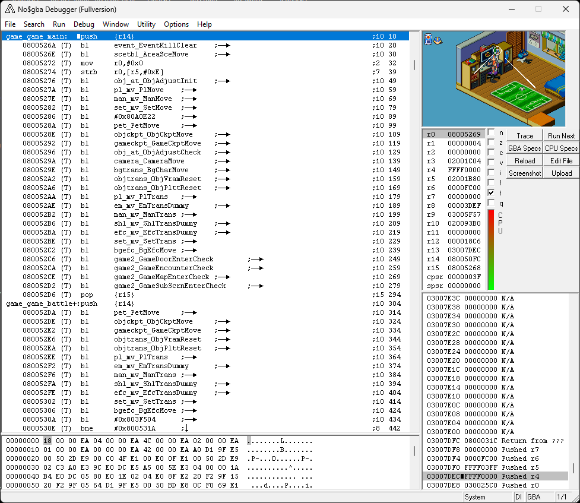

# Mega Man Battle Network 6 Symbols
This .sym file contains some of the original function names, as found in the Nintendo Switch release of Mega Man Battle Network Legacy Collection.
This file is intended to assist in debugging with no$gba.

*Still a work in progress*

Contains 2 sym files:
+ `MEGAMAN6_GXX_BR5E00.sym` - Functions are prefixed by the file they were found in.
	+ e.g. The function `_AgbMain` in `main.cpp` is labeled `main_AgbMain`
+ `MEGAMAN6_GXX_BR5E00_min_prefix.sym` - Functions that are in CamelCase are not prefixed by the file they were found in.
	+ e.g. The function `_AgbMain` in `main.cpp` is labeled `_AgbMain`

